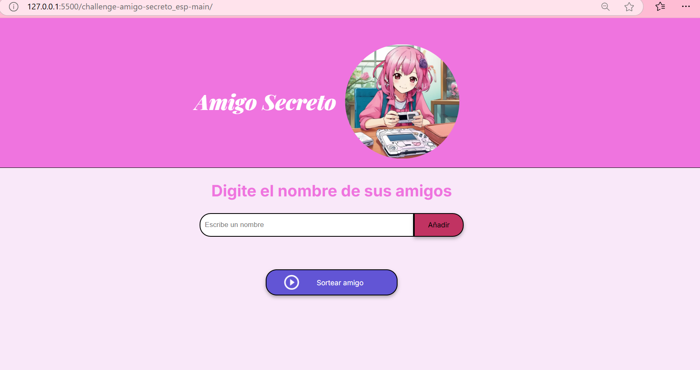
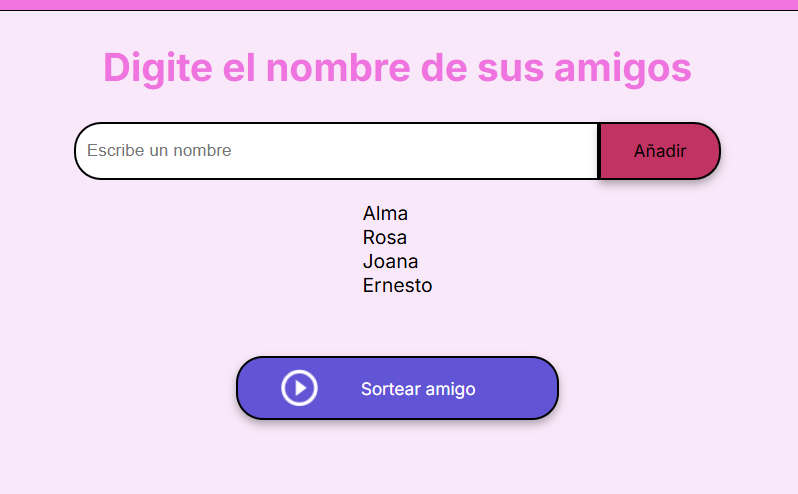
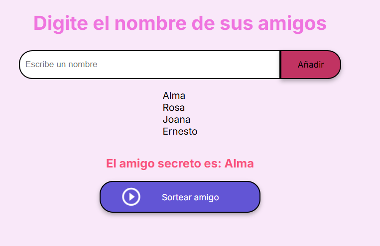

# Proyecto de Alura Latam

Este es un proyecto que realicé en el curso de Alura Latam. A continuación, te presento las especificaciones y vistas del juego.

## Vista Previa del Proyecto

### Especificaciones del Juego:
1. **Agregar Jugadores**: En esta sección, puedes añadir jugadores al juego. Para agregar un nuevo jugador, simplemente ingresa el nombre en el campo correspondiente y haz clic en el botón "Añadir Jugador".
2. **Seleccionar Jugadores**: Cuando añades un jugador, este aparecerá en la lista de jugadores disponibles. Puedes agregar tantos jugadores como desees.

## Agregar Jugadores

### Cómo agregar un jugador:
- Haz clic en el botón **"Añadir"** para agregar un jugador a la lista. El jugador será añadido al sistema, y podrás ver su nombre en la lista.

## Sorteo de Jugadores

### Cómo realizar el sorteo:
- Después de haber agregado todos los jugadores, haz clic en el botón **"Sortear Amigo"** para que el sistema seleccione aleatoriamente a un jugador.
- El nombre del jugador seleccionado aparecerá en pantalla.

## Reflexión

Me gustó mucho realizar este proyecto y tener la oportunidad de poner en práctica lo aprendido. Es genial estar de nuevo practicando y mejorando mis habilidades. ¡Muchas gracias a Alura Latam por ofrecer esta oportunidad de aprender y crecer!
